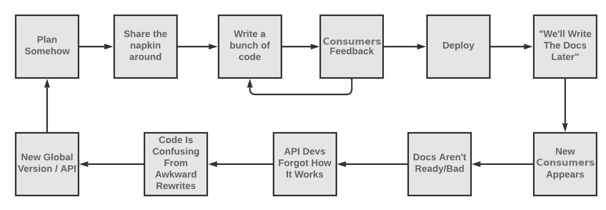
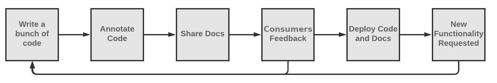
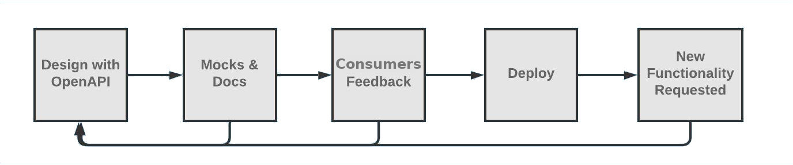
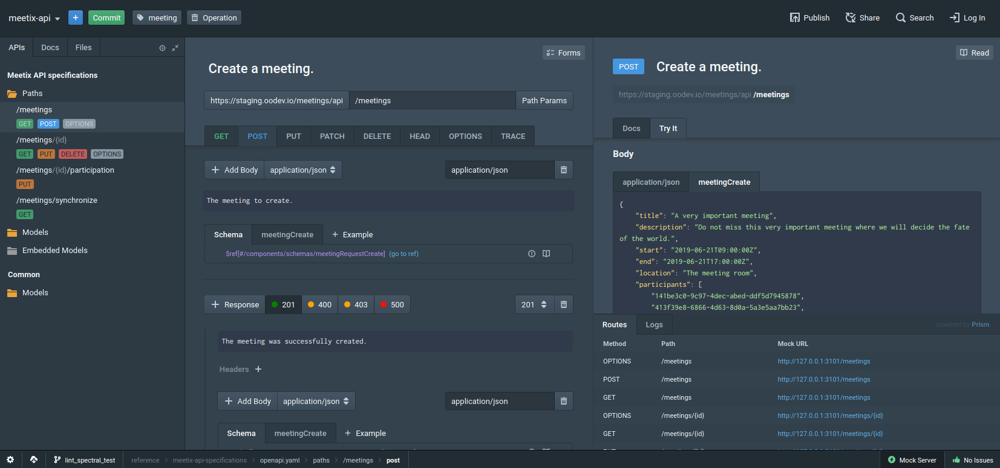
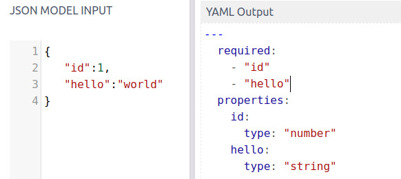
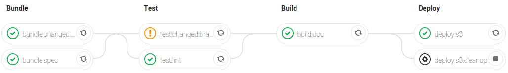
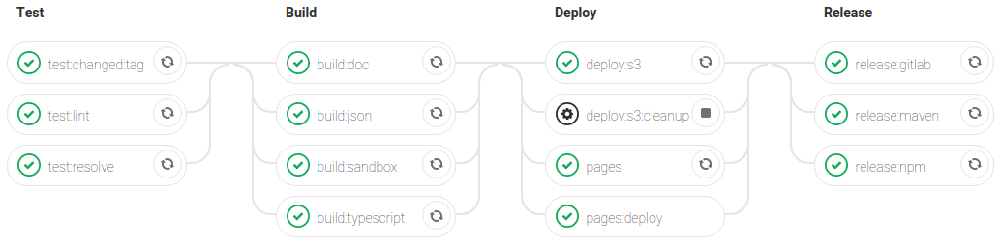
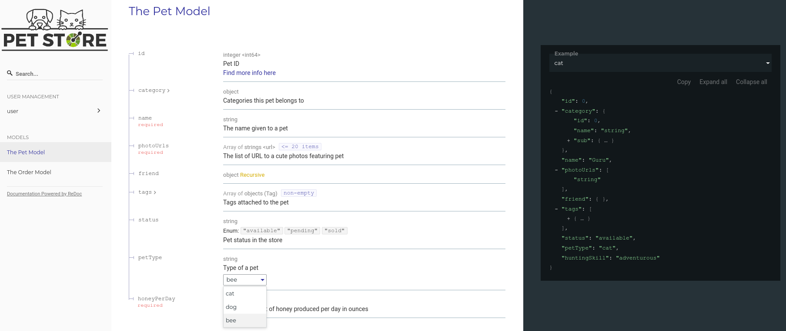
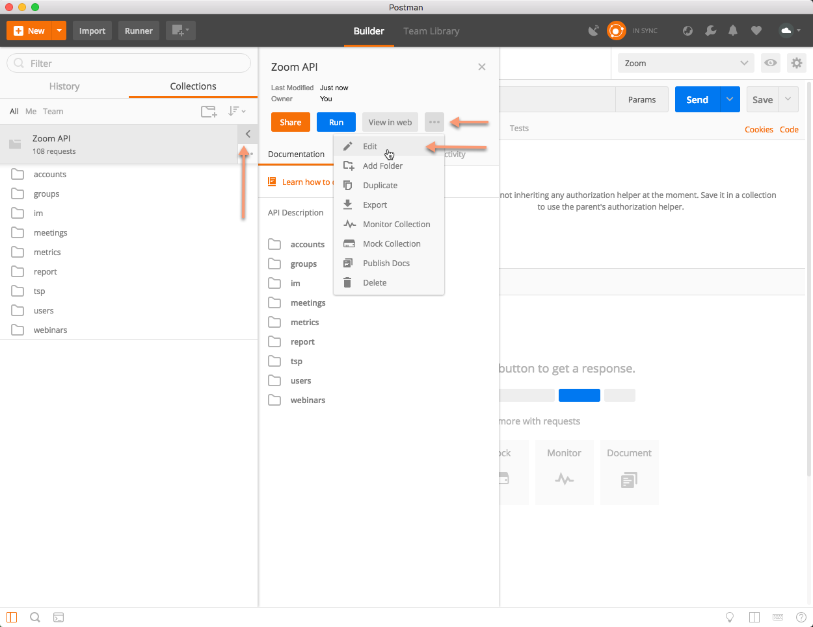
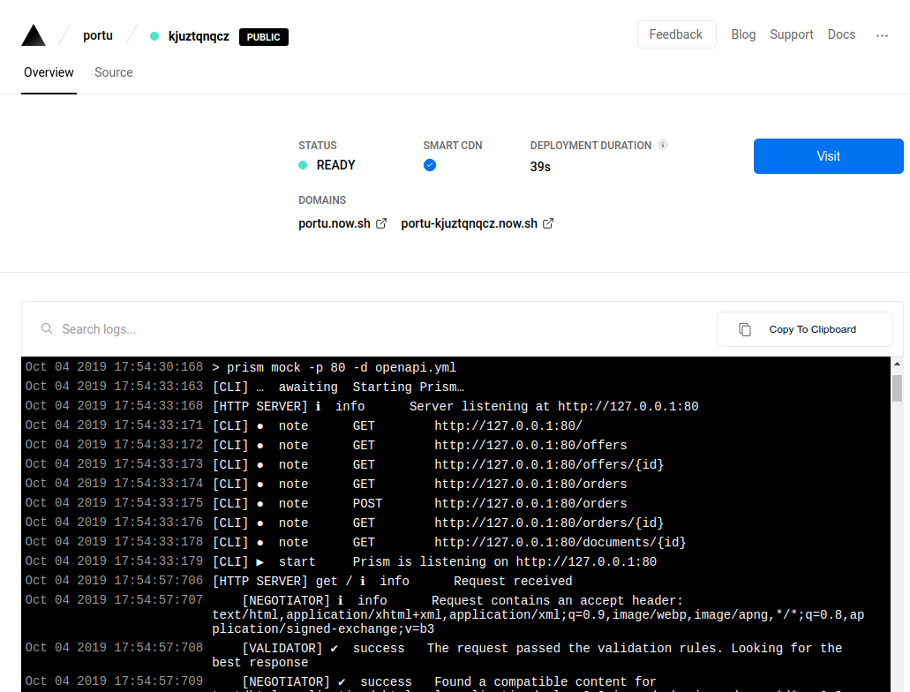

title: API 🛠 for 😄 & 🤖
author:
  name: I'm Adrien, I 🖤 API, a.k.a API lead 🤓
  email: a.gibrat@oodrive.com
theme: ./theme
controls: false
output: index.html

--

# API 🛠 for 😄 & 🤖

-- screen full

### Tools?! 🤚 Thanks, but no thanks...

[](https://openapi.tools "OpenAPI tools is a messy place")

--

## Why? 🧠

- Keep the [API design process simple](https://www.youtube.com/watch?v=CyXzy6T58l8) & [enjoyable](https://apisyouwonthate.com/)
- Get [all the possible value](https://openapi-map.apihandyman.io/) from [OpenAPI specs](https://swagger.io/specification/) <small>(<acronym title="OpenAPI Specification">OAS</acronyme>)</small>
- Ensure [rest](https://en.wikipedia.org/wiki/Representational_state_transfer) API [common practice](https://github.com/openapi-community/style-guide) and [quality](https://blog.florimond.dev/restful-api-design-13-best-practices-to-make-your-users-happy)

-- screen

### You need API specification anyway! 🤦‍♂️

[](https://twitter.com/philsturgeon/status/1182275821496672256)

<p class="fragment"> we all did...</p>

-- screen

### API doc generated from code, don't need spec! 👊

[](https://swagger.io/resources/webinars/automate-code-first-approach-swagger/ "You'll find tools to do that, but...")

<center>
<span class="fragment" style="display:inline-block;vertical-align:top;width:30%"><small>Backend only write API doc 😅</small><br></span>
<span class="fragment" style="display:inline-block;vertical-align:top;width:30%"><small>API doc in code is awkward 🚨</small><br></span>
<span class="fragment" style="display:inline-block;vertical-align:top;width:30%"><small>Too much API code refactor 🤯</small><br></span>
</center>

-- screen

### API design first 🚀

[](https://apisyouwonthate.com/blog/api-design-first-vs-code-first)

1. You'll need a [good editor](https://stoplight.io/studio/)
2. Be sure to [write good spec](https://apihandyman.io/writing-openapi-swagger-specification-tutorial-part-1-introduction/)
3. Deliver [Mocks](https://stoplight.io/open-source/prism/) & [Docs](https://redocly.github.io/redoc/)

--

## OpenAPI editors ✍️

-  [Swagger editor](https://editor.swagger.io/) <small>quick & dirty online editor</small>
-  [Openapi extension](https://marketplace.visualstudio.com/items?itemName=42Crunch.vscode-openapi) <small>or</small><br>
 [Swagger plugin](https://plugins.jetbrains.com/plugin/8347-swagger) <small>or</small><br>
 [KaiZen editor](https://github.com/RepreZen/KaiZen-OpenAPI-Editor)
<small>IDE integration</small>
-  **[Stoplight studio](https://stoplight.io/studio/)** <small>advanced specification suite</small>

-- screen large

### Stoplight studio 🎅

[](https://stoplight.io/studio/ "All in one OpenAPI editor")

--

### Start or migrate to OpenAPI 🏁

You can [start from scrath](http://oodrive-api.oogit.oodrive.net/docs/howto/create-first-oas) or [migrate to openAPI Specification](https://www.youtube.com/watch?v=6kwmW_p_Tig)!

<span class="fragment check" data-icon="⏩">
<span class="fragment" style="float:right">[](https://www.apimatic.io/transformer/ "Transformer works great but automatic transform eventually require manual tuning")</span>
[Swagger, RAML, Blueprint & Postman to OpenAPI](https://www.apimatic.io/transformer/#supported-formats)
</span><br>

<br>

<span class="fragment check" data-icon="👍">
<span class="fragment" style="float:right">[](https://swagger-toolbox.firebaseapp.com/ "JSON or OpenAPI schema are verbose")</span>
[JSON sample to OpenAPI](https://swagger-toolbox.firebaseapp.com/)
</span>

--

## Well written specification 👌

<span class="fragment check" data-icon="📢">[Ask](https://rocket.oodrive.net/channel/api-rest) and [learn](https://apis.guru/browse-apis/) from the best [](https://rocket.oodrive.net/direct/bogdan.ungureanu) [](https://rocket.oodrive.net/direct/paul.prihor) [](https://rocket.oodrive.net/direct/samantha.alwis.karunaratne) [](https://rocket.oodrive.net/direct/jerome.bellier) [](https://rocket.oodrive.net/direct/julien.bour) <small>...</small></span> <small class="fragment">no consumer yet!</small><br>

<span class="fragment check" data-icon="📏">Lint ~~[`speccy`](https://speccy.io/)~~ [`spectral lint openapi.yml`](https://github.com/stoplightio/spectral) <small>in  & </small></span><br>

<span class="fragment check" data-icon="☑">Enforce [common](https://oogit.oodrive.net/oodrive-api/oas-ruleset) rules and [standard](http://oodrive-api.oogit.oodrive.net/docs/references/guidelines.html) practice</span><br>

<span class="fragment check" data-icon="👶">Detect changes [`openapi-diff`](https://github.com/quen2404/openapi-diff) <small>& make changelog</small></span><br>

-- screen

### Tools already in CI 👷

*Merge requests pipeline* [[](https://oogit.oodrive.net/oodrive-api/spec/share-api/pipelines)

*Tag pipeline* [](https://oogit.oodrive.net/oodrive-api/spec/meetix-api/pipelines?scope=tags&page=1)

<a class="fragment" href="https://oogit.oodrive.net/ci-templates/api-doc">
```yaml
include: oogit.oodrive.net/ci-templates/api-doc/open-api-run.yml
```
<a>

--

## Documentation 📑

- [Swagger UI](https://petstore.swagger.io/) <small>quick & easy documentation</small>
- [OpenAPI viewer](https://mrin9.github.io/OpenAPI-Viewer) <small>clean & simple try out</small>
- **[Redoc](https://stoplight.io/studio/)** <small>clear [advanced](https://github.com/Redocly/redoc/blob/master/docs/redoc-vendor-extensions.md) documentation **[+ Postman](http://oodrive-api.oogit.oodrive.net/docs/howto/use-oas-postman)**</small>

-- screen large

### Redoc: API docs you can be proud of 🤩

[](https://github.com/Redocly/redoc/ "Redoc repo")

--

### Redoc, pro tips 🤑

- Displays [data types & formats](https://swagger.io/docs/specification/data-models/data-types/)
- Supports [named examples](https://swagger.io/docs/specification/adding-examples/)
- Practical [x-extension](https://github.com/Redocly/redoc/blob/master/docs/redoc-vendor-extensions.md) & [plugins](https://github.com/Rebilly/RebillyAPI/blob/master/spec/plugins/x-sortableEnum.js)<small>: tags, side-menu, code samples ...</small>
- *Futur version <sup><small>©️</small></sup>* may add [try out](https://github.com/Redocly/redoc/issues/53)<small>, already a [pro feature](https://rebilly.github.io/RebillyAPI)</small>

<small class="fragment">Nah, really... just use Postman ;)</small>

-- screen fullscreen

### Postman, plug & play 📨



--

## Mock 🌠

[Fake auto-generated API](https://stoplight.io/p/docs/gh/stoplightio/prism/docs/guides/workflow.md) allows you to
- Play with API from a simple spec file, even at the <acronym title="Merge Request">MR</acronym> stage
- Start to implement client services & views upfront
- Collect feedbacks from customers / external partners

<span class="fragment check" data-icon="🖧">HTTP Mock server ~~[`apisprout`](https://github.com/danielgtaylor/apisprout)~~ [`prism mock openapi.yml`](https://stoplight.io/p/docs/gh/stoplightio/prism/README.md) <small> again</small></span>

-- screen

### Prism 🛆

[](https://www.youtube.com/watch?v=nZM26knV_ec)

--

### Prism superpowers 🔋

- [Validate request payload & params](https://stoplight.io/p/docs/gh/stoplightio/prism/docs/guides/request-validation.md)<small>, send 400 otherwise</small>
- [Validate servers](https://stoplight.io/p/docs/gh/stoplightio/prism/docs/guides/request-validation.md#server-validation) <small>(request passthrough)</small>
- [Magic query params](https://github.com/stoplightio/prism/blob/master/docs/guides/cli.md#determine-response-status)<br>
   `?__example=myStuff&__code=404&__server=prod `
- Generate [realistic fake data using `x-faker`](https://stoplight.io/p/docs/gh/stoplightio/prism/docs/guides/mock-responses.md#dynamic-response-generation) <small>([vendor extention](https://swagger.io/docs/specification/openapi-extensions/))</small>

-- screen

### POC with Portu, a CertEurope API 🔑

[](https://portu.now.sh/_src)

--

## Next ? ⏭️

- Auto deploy Mock servers?
- Add internal API docs & tryout on [API management Gravitee](https://apim.oodev.io)!
- Continue to support teams adopting [design first with OpenAPI](http://oodrive-api.oogit.oodrive.net/docs/howto/design-an-api/)...
- Stay tuned with [Louis Lin](https://rocket.oodrive.net/direct/louis.lin) ;)
